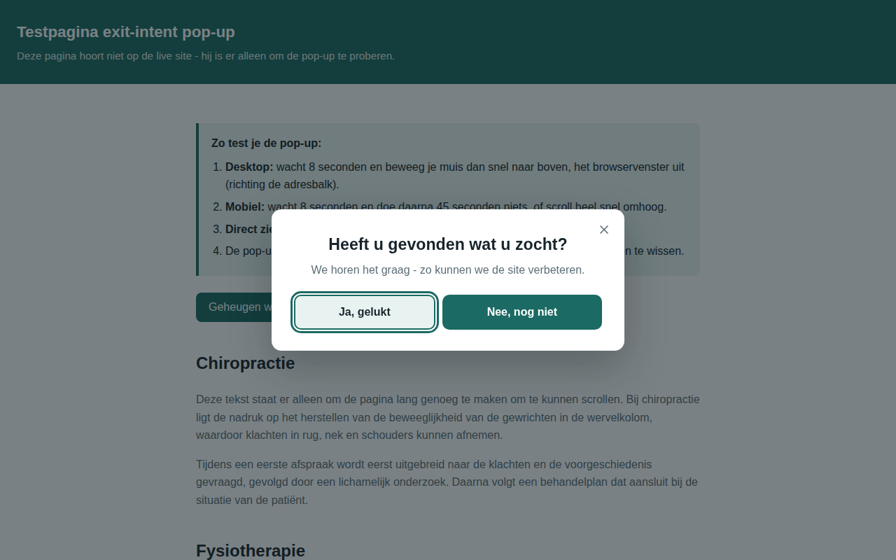
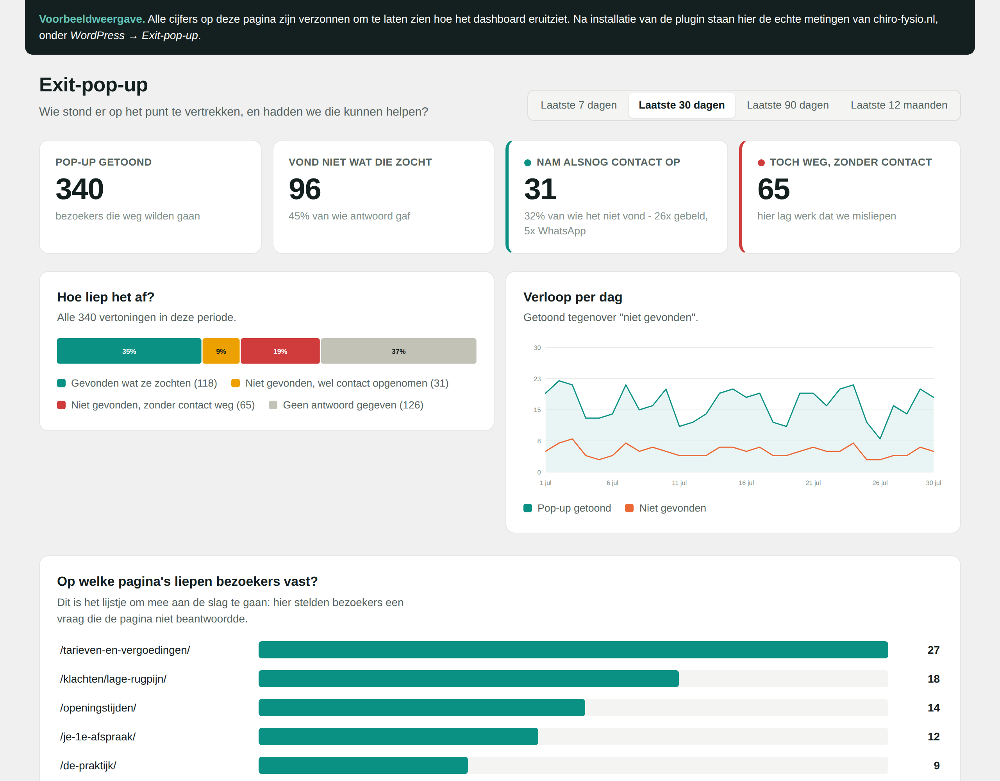

# Exit-intent pop-up voor Chiro-Fysio

Herkent wanneer een bezoeker de site dreigt te verlaten en vraagt dan één korte
vraag: **"Heeft u gevonden wat u zocht?"**

- **Ja** → korte bedankboodschap, met een knop om direct een afspraak te maken.
- **Nee** → het telefoonnummer van de praktijk als grote belknop (en optioneel WhatsApp).

Daarbij hoort een dashboard in WordPress dat laat zien hoe vaak dit gebeurt, op
welke pagina's, en hoeveel van die bezoekers alsnog contact opnemen.

Geen dependencies, geen tracking cookies, geen abonnement op een externe dienst.



---

## Eerst even zelf proberen

Twee manieren, allebei zonder iets te installeren:

- **`demo/demo.html`** — open dit bestand in de browser. Neppagina met uitleg,
  een knop om het "al getoond"-geheugen te wissen en genoeg tekst om te scrollen.
- **`dist/testpagina.html`** — één zelfstandig bestand met een statuspaneel
  (staat de detectie al scherp?), knoppen om de pop-up direct op te roepen, en
  een logboek dat live meeschrijft wat de tool detecteert. Handig om ook op de
  telefoon te bekijken: zet het bestand ergens neer waar je het kunt openen.

Het dashboard bekijken zonder de plugin te installeren kan met
**`demo/dashboard-preview.html`** — dezelfde weergave, gevuld met verzonnen
cijfers.

---

## Snel installeren op WordPress (aanbevolen)

1. Download `dist/chiro-fysio-exit-popup.zip` uit deze repository.
2. Ga in WordPress naar **Plugins → Nieuwe plugin → Plugin uploaden**.
3. Kies het zip-bestand, klik op **Nu installeren** en daarna op **Activeren**.

Klaar. De pop-up is meteen actief voor bezoekers.

> **Let op:** als je zelf ingelogd bent als beheerder zie je de pop-up niet.
> Dat is expres, zodat je rustig kunt werken. Wil je hem toch zien? Zet dan
> `?cf-popup=test` achter de URL, bijvoorbeeld
> `https://www.chiro-fysio.nl/?cf-popup=test`.

### Alternatief: plakken via een snippet-plugin

Gebruik je liever WPCode, "Insert Headers and Footers" of iets vergelijkbaars?
Neem dan de volledige inhoud van `dist/wpcode-snippet.html` over en plak die in
het **footer**-veld. Dat bestand bevat de CSS en JavaScript al bij elkaar.

---

## Voordat je live gaat: even controleren

Deze twee dingen wil je nalopen in `src/exit-intent-popup.js`, bovenin het blok
`CONFIG`:

| Instelling | Nu ingesteld op | Actie |
|---|---|---|
| `phoneDisplay` / `phoneHref` | `024 - 355 88 30` / `+31243558830` | **Controleer of dit klopt.** Ik heb dit nummer van een zoekresultaat gehaald, niet van jullie site zelf (die blokkeerde mijn verzoek). |
| `whatsapp` | leeg | Vul een **mobiel** nummer in als je WhatsApp wilt aanbieden, bijvoorbeeld `31612345678`. Zolang dit leeg is, wordt de WhatsApp-knop netjes verborgen. |

Na het aanpassen van `src/` draai je `./build.sh` om de plugin-zip en het
snippet opnieuw te bouwen.

---

## Alle instellingen

Alles staat bovenaan `src/exit-intent-popup.js`.

| Instelling | Standaard | Wat het doet |
|---|---|---|
| `phoneDisplay` | `024 - 355 88 30` | Nummer zoals de bezoeker het ziet |
| `phoneHref` | `+31243558830` | Nummer voor de belknop (internationaal, geen spaties) |
| `whatsapp` | `''` | WhatsApp-nummer, leeg = knop verbergen |
| `whatsappText` | vraag over de website | Tekst die vast in het WhatsApp-bericht staat |
| `appointmentUrl` | `/uw-afspraak/` | Afspraakknop in het ja-scherm, leeg = verbergen |
| `helpUrl` / `helpLabel` | `/kosten-en-vergoedingen/` | Hulplink in het nee-scherm, leeg = verbergen |
| `armAfterMs` | `6000` | Hoe lang iemand op de site moet zijn voor de pop-up scherp staat |
| `requireInteraction` | `true` | Pas scherpzetten nadat de bezoeker iets gedaan heeft |
| `cooldownDays` | `7` | Hoeveel dagen iemand met rust wordt gelaten na het zien |
| `enableMobile` | `true` | Pop-up ook op telefoon/tablet |
| `mobileIdleMs` | `45000` | Mobiel: na hoeveel stilte de pop-up verschijnt (`0` = uit) |
| `excludePaths` | contact, afspraak, bedankt, vacature | Pagina's waar hij nooit verschijnt |
| `text` | Nederlandse teksten | Alle zinnen in de pop-up |

Bij `excludePaths` schrijf je de termen **zonder schuine streep**. `'/afspraak'`
zou `/je-1e-afspraak/` namelijk missen, omdat daar `-afspraak` staat; `'afspraak'`
dekt alle vier de afspraakpagina's in één keer, en `'vacature'` dekt `/vacatures/`.

De kleuren staan bovenaan `src/exit-intent-popup.css` als CSS-variabelen
(`--cf-primary`, `--cf-accent`, …). Pas die aan naar de huisstijl en de rest
volgt vanzelf.

---

## Hoe herkent hij dat iemand weggaat?

> Liever visueel? Open **`dist/uitleg.html`** — daar kun je het signaal zelf
> uitlokken in een kader en zie je meteen wanneer het wel en niet afgaat.

**We volgen de muis niet.** Er worden geen muisbewegingen bijgehouden, opgeslagen
of in een kaart verwerkt. De browser geeft zelf één melding door — "de aanwijzer
heeft het venster verlaten" — en daarop stellen we één vraag: gebeurde dat aan de
bovenkant?

**Op desktop** is dat het hele signaal. Verlaat de aanwijzer het venster naar
boven — richting de adresbalk, de tabbladen, de terugknop of het kruisje — dan
staat iemand op het punt te vertrekken maar is die er nog. Gaat de muis er via
links, rechts of onder uit, dan negeren we het: daar liggen meestal een tweede
scherm of de taakbalk, en dat zegt niets over vertrekken.

**Op mobiel en tablet** bestaat er geen muis. Daar gebruiken we twee andere
signalen: 45 seconden lang geen enkele aanraking, of heel snel omhoog swipen
naar de bovenkant van de pagina (meestal een teken dat iemand naar de terugknop
of de adresbalk gaat).

Wil je het rustiger houden? Zet `enableMobile` op `false` of verhoog
`mobileIdleMs`.

### De vijf voorwaarden

Het signaal alleen is niet genoeg. Dit moet allemaal kloppen, in deze volgorde —
valt er één af, dan gebeurt er niets:

1. De bezoeker is niet op een contact-, afspraak-, bedankt- of vacaturepagina
2. De pop-up is deze bezoeker de afgelopen 7 dagen niet getoond
3. Het is geen ingelogde beheerder
4. De bezoeker is minstens 6 seconden op de pagina én heeft iets gedaan
5. Dán pas: de muis verlaat het venster aan de bovenkant

Na één vertoning gaat de herkenning uit voor de rest van het bezoek.

---

## Waarom de instellingen zo staan

De standaardwaarden zijn geen gok: ze komen uit het Analytics-rapport van
**2 t/m 29 juli 2026** (1.277 actieve gebruikers, 1.513 sessies).

| Wat het rapport zei | Wat we ermee deden |
|---|---|
| Gemiddeld 38,3 sec actief, 1,98 pagina's per sessie → ± 19 sec per pagina | `armAfterMs` van 8.000 naar **6.000**. Met 8 seconden was ruim een derde van het venster al voorbij voordat we begonnen te kijken. |
| 31,6% van de gebruikers uit Singapore, de VS, China en Iran (404 van 1.277) | `requireInteraction` erbij: pas scherpzetten ná een echte beweging, scroll, tik of toetsaanslag. Wie een pagina alleen ophaalt en stilzit, komt niet in de metingen. |
| 92,3% nieuwe bezoekers, retentie vrijwel nul (week 1: 2 tot 6 van 231–599) | `cooldownDays` blijft 7. Vrijwel niemand komt terug, dus die grens raakt in de praktijk bijna niemand — en je hebt precies één kans per bezoeker. |
| Geen webshop, omzet € 0, en geen enkele pagina met die naam | `winkelwagen` en `checkout` uit `excludePaths` gehaald: dode instellingen. |
| De vacaturepagina trekt werkzoekenden in plaats van patiënten | `vacature` toegevoegd aan `excludePaths` (dekt `/vacatures/`). Wie werk zoekt, heeft niets aan de vraag of die gevonden heeft wat die zocht. De praktijk bevestigde dat dit de enige extra uitzondering is. |
| 18% van de zoekopdrachten op de site gaat over kosten, tarieven of vergoeding — verspreid over 7 pagina's met samen 2,5% van alle weergaven | `helpUrl` erbij: onder de belknop een rustige link naar *Kosten en vergoedingen*, voor de vraag die het vaakst onbeantwoord blijft. |

### De nulmeting

`tel` wordt al gemeten in GA4: **19 kliks in 28 dagen**, oftewel 1,26% van de
sessies. Dat is het getal om straks tegen af te zetten. Ter vergelijking: 288
sessies (19,0%) begonnen een online afspraak en 151 (10,0%) klikten door.
Bezoekers boeken dus liever online dan dat ze bellen — maar wie een *vraag*
heeft, heeft een mens nodig, en daar is de belknop voor.

### Wat het rapport niet kon zeggen

Het is een momentopname van één maand met alleen paginatitels, geen paden en geen
uitstappercentages per pagina. Voor de vraag *op welke pagina's* de pop-up het
meest oplevert, is het rapport "Pagina's en schermen" met de kolom
betrokkenheidstijd nodig, plus de zoekopdrachten uit Search Console. De
uitgesloten paden hierboven zijn afgeleid uit titels — controleer of ze
overeenkomen met de echte URL's.

---

## Niet vervelend worden

Een pop-up die te vaak of te vroeg komt, kost bezoekers in plaats van dat hij ze
oplevert. Daarom zit er het volgende in:

- Pas actief **na 6 seconden** op de pagina, en alleen na een echte interactie.
- **Maximaal één keer per 7 dagen** per bezoeker.
- **Nooit** op de contact-, afspraak- of bedanktpagina — daar is de bezoeker al
  aan het doen wat we willen.
- Sluiten kan met het kruisje, met Escape, of door naast de pop-up te klikken.
- Beheerders die ingelogd zijn, zien hem niet.

---

## Toegankelijkheid en privacy

- Werkt volledig met het toetsenbord; de focus blijft binnen de pop-up en keert
  daarna terug naar waar de bezoeker was.
- `role="dialog"` en `aria-modal` voor schermlezers.
- Respecteert `prefers-reduced-motion` voor wie bewegende animaties liever niet ziet.
- Knoppen zijn minstens 50px hoog, prettig aan te tikken op een telefoon.
- **AVG:** er worden geen persoonsgegevens verzameld en geen tracking cookies
  geplaatst. Het enige dat wordt opgeslagen is één datum in `localStorage` van de
  bezoeker zelf, om te onthouden dat de pop-up al getoond is. Daar is geen
  cookiemelding voor nodig (functionele opslag).

---

## Het dashboard

Na activatie verschijnt **Exit-pop-up** in het linkermenu van WordPress.



### De vier cijfers bovenaan

| Cijfer | Wat het betekent |
|---|---|
| **Pop-up getoond** | Bezoekers die op het punt stonden te vertrekken |
| **Vond niet wat die zocht** | Daarvan het aantal dat "nee" antwoordde |
| **Nam alsnog contact op** | Die "nee" zeiden en daarna belden, appten of een afspraak maakten |
| **Toch weg, zonder contact** | Die "nee" zeiden en alsnog vertrokken — hier lag werk dat je misliep |

Het percentage bij "vond niet wat die zocht" rekent met de mensen die
daadwerkelijk antwoord gaven. Van wie wegklikt weten we het simpelweg niet, en
die meetellen zou het beeld vertekenen.

### Wat er verder in staat

- **Hoe liep het af** — alle vertoningen verdeeld over de vier uitkomsten.
- **Verloop per dag** — getoond tegenover "niet gevonden", met details bij hover.
- **Op welke pagina's liepen bezoekers vast** — het meest bruikbare lijstje van
  het hele dashboard. Hier stelden bezoekers een vraag die de pagina niet
  beantwoordde, dus dit is meteen je verbeterlijstje.
- **Wanneer op de dag** — verschijnt de pop-up vooral buiten openingstijden, dan
  is bellen op dat moment geen bruikbaar aanbod en is WhatsApp of een
  terugbelverzoek waardevoller.
- **Apparaat en signaal** — desktop tegenover mobiel, en waardoor de pop-up
  verscheen.
- **Laatste vertoningen** — de 50 meest recente regels, plus een knop om alles
  als CSV te downloaden voor Excel.

Kies bovenaan de periode: 7 dagen, 30 dagen, 90 dagen of 12 maanden.

### Wat er wel en niet wordt vastgelegd

Per vertoning wordt één regel bewaard: tijdstip, het pad van de pagina, of het
een desktop of telefoon was, welk signaal de pop-up opriep, het antwoord, en of
er daarna op een knop is geklikt.

Wat er **niet** in staat: geen IP-adres, geen naam, geen e-mailadres, en geen
cookie waarmee iemand over meerdere bezoeken te volgen is. Een zoekopdracht in
de URL (`?s=...`) wordt afgeknipt, omdat daar zomaar iets persoonlijks in kan
staan. Metingen ouder dan een jaar worden automatisch verwijderd.

Dat betekent dat je hiervoor geen cookiemelding of toestemming nodig hebt. Ga je
zelf uitbreiden met gegevens die wél naar een persoon te herleiden zijn, dan
verandert dat — laat dat dan even toetsen.

De metingen blijven staan als je de plugin deactiveert, dus je bent ze niet
kwijt als hij een keer uit gaat.

---

## Blijft het draaien?

Dat is geen theoretische vraag. Tijdens het testen tegen een echte WordPress
bleek een query stuk te lopen op een gereserveerd woord in SQLite, waardoor het
dashboard **nullen toonde alsof het een rustige week was** terwijl de metingen
gewoon binnenkwamen. Zoiets kun je maanden over het hoofd zien. Daarom bewaakt
de plugin zichzelf.

### Statuskaart bovenaan het dashboard

Eén regel met een stoplicht: *Alles draait — laatste meting 11 minuten geleden*.
Klap hem open en je ziet acht controles: staat de tabel er, staan de bestanden
er, is het meetpunt bereikbaar, hoeveel metingen kwamen er binnen in 24 uur en
in 7 dagen, en staan de drie automatische taken nog ingepland.

Het meetpunt wordt echt benaderd, met een bewust onbruikbaar verzoek. Antwoordt
het met "400, dat klopt niet", dan weten we dat het leeft — zonder dat er een
verzonnen meting in je cijfers belandt.

### Meldingen

| Wanneer | Wat |
|---|---|
| Elke ochtend 06:30 | Zelfcontrole. Alleen bij een probleem gaat er een mail uit. |
| Elke maandag 07:30 | Weeksamenvatting: de vier cijfers en de pagina's waar bezoekers vastliepen. |
| Dagelijks | Metingen ouder dan een jaar opruimen. |

Een storingsmelding komt **hooguit eens per week** terug zolang het probleem
duurt, en pas nadat de plugin minstens 15 metingen heeft gedaan — een verse
installatie die nog op zijn eerste bezoeker wacht, is geen storing. Een lege
week levert geen weekmail op.

Meldingen gaan standaard naar het beheerdersadres van de site. Een ander adres
instellen kan met de optie `cf_exit_popup_mail_to`.

### Bestand tegen updates en cacheplugins

De meest voorkomende manier waarop zoiets stilletjes stopt: een
optimalisatieplugin voegt alle JavaScript samen of stelt het uit, en het script
draait daarna te laat of niet meer. De scripttag draagt daarom markeringen die
bij de bekende plugins "deze met rust laten" betekenen:

```html
<script data-no-optimize="1" data-no-defer="1" data-cfasync="false"
        data-nowprocket data-no-minify="1" ...>
```

Dat dekt Autoptimize, WP Rocket, LiteSpeed Cache, SG Optimizer, Swift
Performance en Cloudflare Rocket Loader.

Verder: het is een losstaande plugin, dus een thema-update raakt hem niet. De
geplande taken worden bij elk beheerbezoek nagelopen en hersteld als ze
verdwenen zijn. En als het meetpunt onbereikbaar is, blijft de pop-up gewoon
werken voor de bezoeker — die merkt er niets van.

---

## Meten via Google Analytics

Naast het eigen dashboard worden dezelfde gebeurtenissen doorgegeven aan Google
Analytics of Tag Manager, als die op de site staan, onder de naam
`cf_exit_popup`:

| Actie | Wanneer |
|---|---|
| `open` | pop-up verschijnt (met de trigger: `mouseleave`, `idle` of `scroll-up`) |
| `answer` | bezoeker klikt ja of nee |
| `call` | bezoeker klikt op de belknop |
| `whatsapp` | bezoeker klikt op WhatsApp |
| `appointment` | bezoeker klikt op afspraak maken |
| `close` | pop-up wordt gesloten |

De verhouding tussen `open` en `answer: nee` vertelt je iets waardevols: hoeveel
bezoekers vertrekken zonder gevonden te hebben wat ze zochten. Dat is meteen een
lijstje met wat er op de site beter kan.

Wil je er zelf iets aan hangen, dan kan dat ook via een event op `window`:

```js
window.addEventListener('cf-exit-popup', function (e) {
  console.log(e.detail.action, e.detail.data);
});
```

Je kunt de pop-up ook zelf oproepen, bijvoorbeeld vanaf een eigen knop:

```js
cfExitPopup.toon();     // toon hem meteen
cfExitPopup.vergeet();  // wis het "al getoond"-geheugen en zet de detectie weer scherp
```

---

## Wat staat waar

```
src/                            de bronbestanden - hier pas je dingen aan
  exit-intent-popup.js          gedrag + alle instellingen van de pop-up
  exit-intent-popup.css         vormgeving + kleuren van de pop-up
  dashboard.js / dashboard.css  het dashboard in WordPress
wordpress/chiro-fysio-exit-popup/
  chiro-fysio-exit-popup.php    de plugin zelf
  includes/                     opslag, meetpunt, dashboard en bewaking
dist/                           resultaat van ./build.sh
  chiro-fysio-exit-popup.zip    de plugin, klaar om te uploaden
  wpcode-snippet.html           plakversie voor een snippet-plugin
  testpagina.html               zelfstandige testpagina
  uitleg.html                   visuele uitleg van de herkenning
demo/                           lokaal uitproberen
  demo.html                     testpagina met de pop-up
  dashboard-preview.html        dashboard met verzonnen cijfers
  uitleg.template.html          bron van de uitlegpagina
build.sh                        bouwt dist/ opnieuw na een wijziging
```

Pas je iets aan in `src/`? Draai daarna `./build.sh`, anders blijft de plugin op
de oude versie staan.
